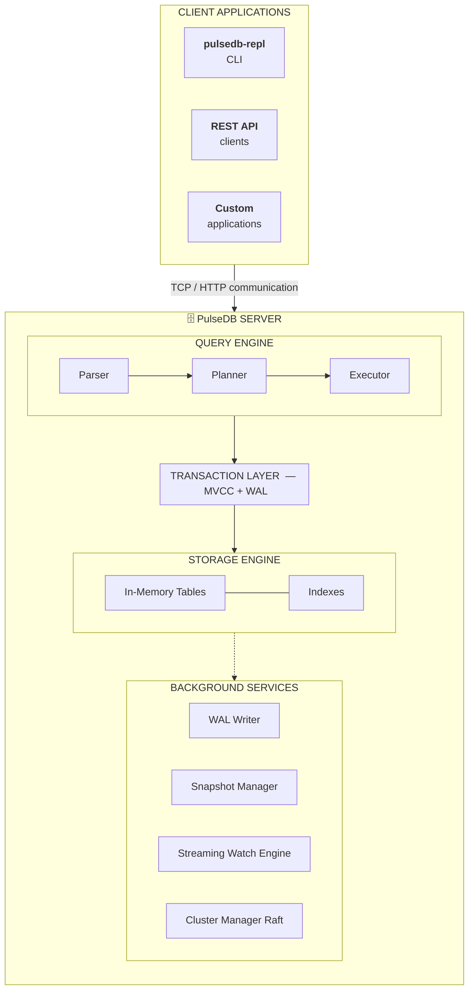

# PulseDB

> **A high-performance database engine built in Rust with its own query language — PulseQL.**

[](https://github.com/Ajaikumar0712/PulseDB)
[](LICENSE)
[](https://github.com/Ajaikumar0712/PulseDB/releases)
[](https://www.rust-lang.org)

PulseDB is a self-contained, production-ready database engine that stores data in-memory with WAL-backed durability, communicates over TCP using JSON, and is queried with **PulseQL** — a purpose-built, SQL-inspired query language.

**Made by Ajaikumar · [ForNexus](https://fornexus.tech)**

---

## At a Glance

| Feature | Description |
|---|---|
| **PulseQL** | Custom query language — clean, readable, not SQL |
| **In-memory + WAL** | Fast reads/writes with Write-Ahead Log durability |
| **Joins** | INNER, LEFT, RIGHT joins across tables in one query |
| **Aggregation** | GROUP BY with COUNT, SUM, AVG, MIN, MAX and HAVING |
| **Fuzzy Search** | Trigram-based text similarity search (`~`) |
| **Vector Search** | Cosine similarity search with HNSW index (`SIMILAR`) |
| **Streaming** | Real-time push subscriptions with `WATCH` |
| **Transactions** | `BEGIN` / `COMMIT` / `ROLLBACK` with MVCC isolation |
| **Security** | Users, SHA-256 passwords, roles, per-table permissions |
| **Clustering** | Peer heartbeats, Raft consensus, FNV-1a shard routing |
| **REST API** | Auto-generated HTTP endpoint per table (`API GENERATE`) |
| **Windows Service** | Runs as a background service that starts with Windows |
| **Linux / systemd** | Prints a ready-to-use systemd unit file (`systemd-unit`) |
| **Docker** | Official multi-stage image — single node or 3-node cluster |
| **MSI Installer** | One-click install on Windows |
| **Client SDKs** | Python, Go, and JavaScript clients included |

---

## Quick Start

### 1 · Install

Download **`pulsedb-0.2.0-x86_64.msi`** and double-click to install.

This places `pulsedb-server.exe` and `pulsedb-repl.exe` in:
```
C:\Program Files\PulseDB\bin\
```
That folder is automatically added to your system `PATH`.

### 2 · Start the Server

Open **any terminal** and run:

```powershell
pulsedb-server
```

You should see:
```
[INFO] PulseDB 0.2.0 listening on 127.0.0.1:7878
```

### 3 · Connect and Query

Open a **second terminal** and run:

```powershell
pulsedb-repl
```

At the `pulseql>` prompt, try:

```sql
MAKE TABLE users (id int PRIMARY KEY, name text, age int)

PUT users { id: 1, name: "Alice", age: 30 }
PUT users { id: 2, name: "Bob",   age: 25 }

GET users
GET users WHERE age >= 28 ORDER BY name ASC
```

That's it — you're running PulseDB.

---

## Table of Contents

1. [Installation](#installation)
   - [MSI Installer (Windows)](#option-a--msi-installer-windows)
   - [Build from Source](#option-b--build-from-source)
   - [Docker](#option-c--docker)
2. [Running the Server](#running-the-server)
3. [Windows Service](#windows-service)
4. [Linux Service (systemd)](#linux-service-systemd)
5. [Connecting with the REPL](#connecting-with-the-repl)
6. [Client SDKs](#client-sdks)
   - [Python](#python)
   - [Go](#go)
   - [JavaScript](#javascript)
7. [PulseQL Language Reference](#pulseql-language-reference)
   - [Data Types](#data-types)
   - [Table Management](#table-management)
   - [Writing Data](#writing-data)
   - [Reading Data](#reading-data)
   - [Joins](#joins)
   - [Aggregation & GROUP BY](#aggregation--group-by)
   - [Fuzzy Search](#fuzzy-search)
   - [Vector Similarity Search](#vector-similarity-search)
   - [Streaming Watch Queries](#streaming-watch-queries)
   - [Transactions](#transactions)
   - [REST API](#rest-api)
   - [Security & User Management](#security--user-management)
   - [Cluster Commands](#cluster-commands)
   - [Triggers](#triggers)
   - [Graph Queries](#graph-queries)
   - [Time Travel Queries](#time-travel-queries)
   - [AI Search](#ai-search)
   - [Admin Commands](#admin-commands)
   - [Resource Configuration](#resource-configuration)
8. [Expressions & Operators](#expressions--operators)
9. [Response Format](#response-format)
10. [Metrics](#metrics)
11. [Architecture](#architecture)
12. [Quick Reference Card](#quick-reference-card)
13. [Troubleshooting](#troubleshooting)
14. [License & Pricing](#license--pricing)

---

## Installation

### Option A — MSI Installer (Windows)

1. Download `pulsedb-0.2.0-x86_64.msi` from the [releases page](https://github.com/Ajaikumar0712/PulseDB/releases)
2. Double-click and follow the installer wizard
3. Accept the BUSL-1.1 license agreement
4. Keep "Add to PATH" checked (recommended)
5. Click **Install**

**Installed files:**

| File | Location |
|---|---|
| `pulsedb-server.exe` | `C:\Program Files\PulseDB\bin\` |
| `pulsedb-repl.exe` | `C:\Program Files\PulseDB\bin\` |
| `LICENSE` | `C:\Program Files\PulseDB\` |
| `PulseDB_Documentation.docx` | `C:\Program Files\PulseDB\` |

To uninstall: **Settings → Apps → PulseDB → Uninstall**

---

### Option B — Build from Source

**Requirements:** Rust 1.70 or newer — install from [rustup.rs](https://rustup.rs)

```powershell
git clone https://github.com/Ajaikumar0712/PulseDB
cd PulseDB

# Release build (optimised, recommended)
cargo build --release

# Run the test suite (104 tests)
cargo test
```

Output binaries:

| Binary | Path |
|---|---|
| `pulsedb-server.exe` | `target\release\pulsedb-server.exe` |
| `pulsedb-repl.exe` | `target\release\pulsedb-repl.exe` |

---

### Option C — Docker

No Rust toolchain required. Works on Linux, macOS, and Windows with Docker Desktop.

```bash
# Pull and run
docker compose up -d

# Connect with the REPL
docker run --rm -it --network host pulsedb/pulsedb pulsedb-repl
```

Data is persisted in a named Docker volume (`pulsedb-data`). To run a 3-node cluster, see the commented cluster section in `docker-compose.yml`.

```bash
# Build the image locally instead
docker build -t pulsedb/pulsedb .
docker run -p 7878:7878 -v pulsedb-data:/var/lib/pulsedb pulsedb/pulsedb
```

---

## Running the Server

Start PulseDB in the foreground. Logs print to the terminal. Press `Ctrl+C` to stop.

```powershell
pulsedb-server
```

Default address: `127.0.0.1:7878`

### Server Flags

| Flag | Short | Default | Description |
| --- | --- | --- | --- |
| `--addr <HOST:PORT>` | `-a` | `127.0.0.1:7878` | Address and port to listen on |
| `--wal <PATH>` | `-w` | `pulsedb.wal` | Path to the Write-Ahead Log file |
| `--data-dir <PATH>` | `-d` | `pulsedb-data` | Directory for catalog and disk snapshots |
| `--log-level <LEVEL>` | `-l` | `info` | Verbosity: `trace`, `debug`, `info`, `warn`, `error` |
| `--mode <MODE>` | | `memory` | Storage mode: `memory` or `disk` |
| `--row-cache <N>` | | `500000` | Per-table in-memory row limit before disk eviction (disk mode only) |

**Examples:**

```powershell
# Listen on all network interfaces
pulsedb-server --addr 0.0.0.0:7878

# Custom WAL file and data directory
pulsedb-server --wal C:\data\pulsedb.wal --data-dir C:\data\pulsedb

# Enable disk mode with 100k row cache per table
pulsedb-server --mode disk --row-cache 100000

# Debug logging
pulsedb-server --log-level debug

# All flags combined
pulsedb-server --addr 0.0.0.0:7878 --wal C:\data\pulsedb.wal --data-dir C:\data\pulsedb --mode disk --log-level info
```

---

## Windows Service

The Windows Service lets PulseDB run automatically in the background — it starts when Windows boots, with no terminal required.

> **All service commands require an Administrator terminal.**
> Right-click PowerShell → "Run as Administrator"

### Setup Workflow

```powershell
# 1. Register the service (only needed once)
pulsedb-server install

# 2. Start it
pulsedb-server start

# 3. Connect from any terminal (no admin needed)
pulsedb-repl

# 4. Stop when finished
pulsedb-server stop

# 5. Remove the service registration
pulsedb-server uninstall
```

You can also manage it from the Windows Services panel:
`Win+R → services.msc → "PulseDB Database"`

### Install with Custom Settings

The address and WAL path you specify at install time are baked into the service:

```powershell
pulsedb-server --addr 0.0.0.0:7878 --wal C:\data\pulsedb.wal install
```

### Service Command Reference

| Command | Description | Requires Admin |
|---------|-------------|:--------------:|
| `pulsedb-server install` | Register as a Windows Service | ✅ |
| `pulsedb-server uninstall` | Remove the service registration | ✅ |
| `pulsedb-server start` | Start the service | ✅ |
| `pulsedb-server stop` | Stop the service | ✅ |

---

## Linux Service (systemd)

On Linux (and macOS), PulseDB can run as a systemd service. Use `systemd-unit` to print a ready-to-use unit file, then install it:

```bash
# Print the unit file
pulsedb-server --addr 0.0.0.0:7878 --data-dir /var/lib/pulsedb systemd-unit

# Install it (requires root)
pulsedb-server --addr 0.0.0.0:7878 --data-dir /var/lib/pulsedb systemd-unit \
  | sudo tee /etc/systemd/system/pulsedb.service

sudo systemctl daemon-reload
sudo systemctl enable --now pulsedb

# Connect from anywhere
pulsedb-repl --addr 127.0.0.1:7878
```

The generated unit file runs the server as a `pulsedb` system user with `Restart=on-failure`.

---

## Connecting with the REPL

`pulsedb-repl` is the interactive command-line client.

```powershell
# Connect to the local server (default: 127.0.0.1:7878)
pulsedb-repl

# Connect to a remote server
pulsedb-repl --addr 192.168.1.10:7878
```

At the `pulseql>` prompt, type any PulseQL statement and press Enter to execute it.

| Input | Action |
|-------|--------|
| Any PulseQL statement | Execute and print result |
| `help` or `\help` | Show help |
| `exit`, `quit`, or `\q` | Disconnect and exit |
| `Ctrl+C` / `Ctrl+D` | Disconnect and exit |

---

## Client SDKs

Official client libraries are in the `clients/` directory. Each wraps the TCP + JSON protocol and exposes a native API for its language.

---

### Python

**Requirements:** Python 3.8+, no extra dependencies.

```bash
pip install clients/python
```

```python
from pulsedb import PulseDB, PulseDBError

with PulseDB.connect("127.0.0.1", 7878) as db:
    db.auth("alice", "secret123")

    db.query("MAKE TABLE users (id int PRIMARY KEY, name text, age int)")
    db.query('PUT users { id: 1, name: "Alice", age: 30 }')
    db.query('PUT users { id: 2, name: "Bob",   age: 25 }')

    result = db.query("GET users WHERE age >= 28")
    for row in result:
        print(row.id, row.name, row.age)
        # or: print(row.as_dict())

    # Single row
    first = db.query("GET users LIMIT 1").rows[0]
    print(first["name"])
```

**API:**

| Method | Description |
| --- | --- |
| `PulseDB.connect(host, port)` | Open a connection (class method) |
| `db.auth(username, password)` | Authenticate the session |
| `db.query(q)` | Execute any PulseQL string; returns `Result` |
| `db.close()` | Close the connection |
| `result.rows` | List of `Row` objects |
| `result.columns` | List of column names |
| `row["col"]` / `row.col` | Access a column value by name |
| `row.as_dict()` | Row as a plain dict |

---

### Go

**Requirements:** Go 1.18+.

```bash
go get github.com/Ajaikumar0712/PulseDB/clients/go
```

```go
package main

import (
    "fmt"
    pulsedb "github.com/Ajaikumar0712/PulseDB/clients/go"
)

func main() {
    c, err := pulsedb.Connect("127.0.0.1:7878")
    if err != nil {
        panic(err)
    }
    defer c.Close()

    c.Auth("alice", "secret123")

    c.Query(`MAKE TABLE users (id int PRIMARY KEY, name text, age int)`)
    c.Query(`PUT users { id: 1, name: "Alice", age: 30 }`)

    result, err := c.Query("GET users WHERE age >= 28")
    if err != nil {
        panic(err)
    }
    for _, row := range result.Rows {
        fmt.Println(row.Get("id"), row.Get("name"))
        // or: row.Fields() → map[string]interface{}
    }
}
```

**API:**

| Function / Method | Description |
| --- | --- |
| `pulsedb.Connect(addr)` | Dial TCP; returns `*Client` |
| `c.Auth(username, password)` | Authenticate the session |
| `c.Query(q)` | Execute any PulseQL string; returns `*Result` |
| `c.Close()` | Close the connection |
| `result.Rows` | `[]*Row` |
| `row.Get("col")` | Column value by name |
| `row.Fields()` | Row as `map[string]interface{}` |

The `Client` is thread-safe — a single connection can be shared across goroutines.

---

### JavaScript

**Requirements:** Node.js 14+, no npm dependencies.

```bash
# Copy or symlink clients/javascript/index.js into your project
```

```js
const { PulseDB } = require('./clients/javascript');

async function main() {
    const db = await PulseDB.connect({ host: '127.0.0.1', port: 7878 });

    await db.auth('alice', 'secret123');

    await db.query(`MAKE TABLE users (id int PRIMARY KEY, name text, age int)`);
    await db.query(`PUT users { id: 1, name: "Alice", age: 30 }`);

    const result = await db.query('GET users WHERE age >= 28');
    for (const row of result) {
        console.log(row.id, row.name);   // direct property access
        console.log(row.toObject());     // plain object
    }

    db.close();
}

main();
```

**One-shot helper:**

```js
const result = await PulseDB.withConnection(
    async (db) => db.query('GET users LIMIT 10'),
    { host: '127.0.0.1', port: 7878 }
);
```

**API:**

| Method | Description |
| --- | --- |
| `PulseDB.connect(opts)` | Open connection; returns `Promise<PulseDB>` |
| `PulseDB.withConnection(fn, opts)` | Auto-closing one-shot helper |
| `db.auth(username, password)` | Authenticate the session |
| `db.query(q)` | Execute PulseQL; returns `Promise<Result>` |
| `db.close()` | Destroy the socket |
| `result.rows` | Array of `Row` objects |
| `row.<colName>` | Direct property access |
| `row.toObject()` | Row as a plain object |

---

## PulseQL Language Reference

PulseQL is PulseDB's custom query language. It is **not SQL** — it uses different keywords designed to be readable and unambiguous.

- Statements can be separated by semicolons (`;`)
- Identifiers are case-insensitive
- String values use double quotes: `"hello"`
- Passwords use single quotes: `'secret'`

---

### Data Types

| Type | Description | Example |
|------|-------------|---------|
| `int` | 64-bit signed integer | `42`, `-10` |
| `float` | 64-bit floating point | `3.14`, `-0.5` |
| `text` | UTF-8 string | `"hello world"` |
| `bool` | Boolean | `true`, `false` |
| `json` | Any JSON value | `{"key": "val"}` |
| `blob` | Raw binary data | — |
| `vector` | Dense f32 vector for similarity search | `[0.1, 0.9, 0.3]` |
| `null` | Absent / null value | `null` |

---

### Table Management

#### MAKE TABLE — Create a table

```
MAKE TABLE <table> (
    <column> <type> [PRIMARY KEY],
    ...
)
```

```sql
MAKE TABLE users (
    id     int  PRIMARY KEY,
    name   text,
    age    int,
    active bool
)

MAKE TABLE products (
    id    int   PRIMARY KEY,
    name  text,
    price float,
    tags  json
)
```

#### MAKE INDEX — Create an index

Indexes speed up `WHERE` and `ORDER BY` on frequently-queried columns.

```sql
MAKE INDEX ON users (name)
MAKE INDEX ON products (price)
```

#### DROP TABLE — Delete a table and all its data

```sql
DROP TABLE users
```

#### SHOW TABLES — List all tables

```sql
SHOW TABLES
```

---

### Writing Data

#### PUT — Insert or replace a row

```
PUT <table> { <field>: <value>, ... }
```

If a row with the same primary key already exists, `PUT` replaces it (upsert).

```sql
PUT users { id: 1, name: "Alice", age: 30, active: true }
PUT users { id: 2, name: "Bob",   age: 25, active: false }
PUT users { id: 3, name: "Carol", age: 35, active: true }
```

#### SET — Update existing rows

```
SET <table> { <field>: <value>, ... } [WHERE <condition>]
```

```sql
-- Update one row
SET users { age: 31 } WHERE id = 1

-- Update all matching rows
SET users { active: false } WHERE age < 25

-- Update every row (no WHERE clause)
SET products { price: 0.0 }
```

#### DEL — Delete rows

```
DEL <table> [WHERE <condition>]
```

```sql
-- Delete one row
DEL users WHERE id = 2

-- Delete matching rows
DEL users WHERE active = false

-- Clear the entire table
DEL users
```

---

### Reading Data

#### GET — Retrieve rows

```
GET <table>
    [JOIN ...]
    [WHERE <condition>]
    [GROUP BY ...]
    [ORDER BY <column> [ASC | DESC]]
    [LIMIT <n>]
    [TIMEOUT "<duration>"]
```

```sql
-- All rows
GET users

-- Filtered
GET users WHERE active = true
GET users WHERE age >= 25

-- Compound condition
GET users WHERE age >= 25 AND active = true

-- Ordered and limited
GET users ORDER BY age DESC LIMIT 10

-- With query timeout
GET users WHERE active = true TIMEOUT "5s"
```

**TIMEOUT duration formats:**

| Format | Meaning |
|--------|---------|
| `"500ms"` | 500 milliseconds |
| `"5s"` | 5 seconds |
| `"2m"` | 2 minutes |

> The duration must be a **quoted string**: `TIMEOUT "5s"` ✅ — not `TIMEOUT 5s` ❌

---

### Joins

Combine rows from two tables in a single query.

```
GET <left_table>
    [INNER | LEFT | RIGHT] JOIN <right_table> ON <condition>
    [WHERE <condition>]
    [ORDER BY <col>]
    [LIMIT <n>]
```

| Join Type | Returns |
|-----------|---------|
| `INNER JOIN` | Only rows that match in **both** tables |
| `LEFT JOIN` | **All** left rows; `null` for unmatched right columns |
| `RIGHT JOIN` | **All** right rows; `null` for unmatched left columns |

**Setup:**

```sql
MAKE TABLE users  (id int PRIMARY KEY, name text)
MAKE TABLE orders (id int PRIMARY KEY, user_id int, total float)

PUT users  { id: 1, name: "Alice" }
PUT users  { id: 2, name: "Bob" }
PUT orders { id: 10, user_id: 1, total: 49.99 }
PUT orders { id: 11, user_id: 1, total: 12.50 }
```

**Queries:**

```sql
-- Only users who have placed orders
GET users INNER JOIN orders ON users.id = orders.user_id

-- All users, including those with no orders
GET users LEFT JOIN orders ON users.id = orders.user_id

-- Filtered + sorted join
GET users INNER JOIN orders ON users.id = orders.user_id
    WHERE orders.total > 20.0
    ORDER BY orders.total DESC
    LIMIT 5
```

> When both tables share a column name, the right-table column is prefixed with the table name (e.g. `orders.id`).

---

### Aggregation & GROUP BY

Group rows and calculate aggregate values. Use `HAVING` to filter grouped results.

```
GET <table>
    [WHERE <condition>]
    GROUP BY <col> [, <col>]
        [COUNT(*) | SUM(<col>) | AVG(<col>) | MIN(<col>) | MAX(<col>)] [AS <alias>]
    [HAVING <condition>]
    [ORDER BY <col>]
    [LIMIT <n>]
```

**Aggregate functions:**

| Function | Description |
|----------|-------------|
| `COUNT(*)` | Count all rows in the group |
| `COUNT(<col>)` | Count non-null values in a column |
| `SUM(<col>)` | Sum of all values |
| `AVG(<col>)` | Arithmetic mean |
| `MIN(<col>)` | Minimum value |
| `MAX(<col>)` | Maximum value |

**Examples:**

```sql
MAKE TABLE orders (id int PRIMARY KEY, user_id int, country text, total float)

PUT orders { id: 1, user_id: 1, country: "US", total: 49.99 }
PUT orders { id: 2, user_id: 2, country: "US", total: 12.50 }
PUT orders { id: 3, user_id: 3, country: "UK", total: 30.00 }

-- Count orders per country
GET orders GROUP BY country COUNT(*) AS order_count

-- Total revenue per country, only where more than 1 order placed
GET orders GROUP BY country SUM(total) AS revenue HAVING order_count > 1

-- Average order value per user, best first
GET orders GROUP BY user_id AVG(total) AS avg_total ORDER BY avg_total DESC
```

---

### Fuzzy Search

#### FIND — Trigram-based similarity search

Find rows where a text column closely resembles a search pattern. Handles typos and partial matches.

```
FIND <table> WHERE <column> ~ "<pattern>" [LIMIT <n>]
```

Results are ranked by similarity score (best match first).

```sql
-- Finds "Alice" even with typo "alic"
FIND users WHERE name ~ "alic"

-- Partial match — "widge" finds "Widget"
FIND products WHERE name ~ "widge" LIMIT 5
```

The `~` operator can also be used inside a regular `GET`:

```sql
GET users WHERE name ~ "alice"
```

---

### Vector Similarity Search

Store dense float vectors in a `vector` column and search for the closest rows by cosine similarity. Results are ranked by an `_score` column (0.0–1.0). Backed by an **HNSW** index for fast approximate nearest-neighbour lookup.

```
SIMILAR <table> [ON <column>] TO [<f>, <f>, ...] [LIMIT <n>]
```

**Setup:**

```sql
MAKE TABLE items (
    id        int    PRIMARY KEY,
    label     text,
    embedding vector
)

PUT items { id: 1, label: "cat",  embedding: [0.9, 0.1, 0.0] }
PUT items { id: 2, label: "dog",  embedding: [0.8, 0.2, 0.1] }
PUT items { id: 3, label: "fish", embedding: [0.1, 0.1, 0.9] }
```

**Query:**

```sql
SIMILAR items ON embedding TO [0.85, 0.15, 0.05] LIMIT 2
```

**Response:**

```json
{
  "status": "ok",
  "result": {
    "Rows": {
      "columns": ["id", "label", "embedding", "_score"],
      "rows": [
        [1, "cat", "vec[3 dims]", 0.9998],
        [2, "dog", "vec[3 dims]", 0.9965]
      ]
    }
  }
}
```

> If the table has only one `vector` column, `ON <column>` can be omitted.

---

### Streaming Watch Queries

`WATCH` opens a **server-push subscription**. The server streams a JSON event to your connection every time a matching row is inserted, updated, or deleted — no polling required.

#### WATCH — Subscribe to changes

```
WATCH <table> [WHERE <condition>]
```

```sql
WATCH users WHERE active = true
```

**Acknowledgement (sent once immediately):**

```json
{"status":"ok","watch_id":1,"message":"watching, subscription id=1"}
```

**Push events** (one JSON line per change, streamed in real time):

```json
{"status":"watch","id":1,"op":"insert","row":{"id":4,"name":"Dave","age":22,"active":true}}
{"status":"watch","id":1,"op":"update","row":{"id":2,"name":"Bob","age":26,"active":true}}
{"status":"watch","id":1,"op":"delete","row":{"id":3,"name":"Carol","age":35,"active":true}}
```

| `op` | Triggered by |
|------|-------------|
| `insert` | `PUT` added a row matching the filter |
| `update` | `SET` changed a row matching the filter |
| `delete` | `DEL` removed a row that matched the filter |

You can have multiple active subscriptions per connection — each gets a unique `watch_id`. Other queries can still run on the same connection while watching.

#### UNWATCH — Cancel a subscription

```sql
UNWATCH 1
```

---

### Transactions

Operations inside a transaction are applied atomically — either **all succeed** or **all are rolled back**.

```sql
BEGIN

PUT users { id: 10, name: "Dave", age: 28, active: true }
SET users { age: 29 } WHERE id = 10
DEL users WHERE id = 5

COMMIT
```

**Rollback:**

```sql
BEGIN
PUT users { id: 99, name: "Test", age: 0 }
ROLLBACK
```

| Statement | Description |
|-----------|-------------|
| `BEGIN` | Start a transaction |
| `COMMIT` | Apply all changes permanently |
| `ROLLBACK` | Discard all changes since `BEGIN` |

PulseDB uses **MVCC (Multi-Version Concurrency Control)** — readers never block writers and writers never block readers.

---

### REST API

PulseDB can expose any table as an HTTP REST endpoint — useful for integrating with tools or services that speak HTTP instead of PulseQL.

#### API GENERATE — Create HTTP endpoints for a table

```
API GENERATE FOR <table>
```

```sql
API GENERATE FOR users
```

This starts an HTTP server on an auto-assigned port (starting at 7879) and logs the address. Five endpoints are created per table:

| Method | Path | Action |
| --- | --- | --- |
| `GET` | `/api/<table>` | Fetch all rows |
| `POST` | `/api/<table>` | Insert a row (body: JSON object) |
| `GET` | `/api/<table>/<id>` | Fetch a single row by UUID |
| `PUT` | `/api/<table>/<id>` | Update row fields (body: partial JSON) |
| `DELETE` | `/api/<table>/<id>` | Delete a row |

> Nested objects are not supported in POST/PUT request bodies.

**Example (PowerShell):**

```powershell
# Read all rows
Invoke-RestMethod -Uri "http://127.0.0.1:7879/api/users" -Method GET

# Insert a row
Invoke-RestMethod -Uri "http://127.0.0.1:7879/api/users" -Method POST `
    -ContentType "application/json" `
    -Body '{"id":99,"name":"REST User","age":22}'

# Fetch by ID
Invoke-RestMethod -Uri "http://127.0.0.1:7879/api/users/<uuid>" -Method GET

# Update fields
Invoke-RestMethod -Uri "http://127.0.0.1:7879/api/users/<uuid>" -Method PUT `
    -ContentType "application/json" `
    -Body '{"age":23}'

# Delete
Invoke-RestMethod -Uri "http://127.0.0.1:7879/api/users/<uuid>" -Method DELETE
```

#### API STOP — Shut down an endpoint

```sql
API STOP FOR users
```

#### SHOW APIS — List active endpoints

```sql
SHOW APIS
```

Returns each active table alongside its port number.

---

### Security & User Management

PulseDB supports user accounts with SHA-256 hashed passwords, admin roles, and per-table operation grants.

By default the server starts in **open mode** — no authentication required. When secured mode is enabled, every connection must call `AUTH` before running queries.

#### AUTH — Authenticate a session

```sql
AUTH alice 'secret123'
```

#### CREATE USER — Add a user account

```sql
-- Regular user
CREATE USER bob PASSWORD 'hunter2'

-- Admin user (can manage users and grants)
CREATE ADMIN USER carol PASSWORD 'admin-pass'
```

#### DROP USER — Remove a user

```sql
DROP USER bob
```

#### GRANT — Give a user permission on a table

```
GRANT <op> ON <table | *> TO <username>
```

Operations: `select`, `insert`, `update`, `delete`, `all`

```sql
-- Allow bob to read from users
GRANT select ON users TO bob

-- Give carol full access to all tables
GRANT all ON * TO carol
```

#### REVOKE — Remove a permission

```sql
REVOKE insert ON orders FROM bob
```

#### SHOW USERS — List all accounts

```sql
SHOW USERS
```

| Column | Description |
|--------|-------------|
| `username` | Account name |
| `is_admin` | `true` if the account has admin privileges |

---

### Cluster Commands

PulseDB supports a lightweight cluster layer with TCP heartbeat monitoring, Raft-based leader election, and hash-based shard routing.

> **Note:** Data replication between nodes is not yet implemented. The cluster layer currently handles membership tracking and health monitoring only.

#### CLUSTER JOIN — Add a peer node

```sql
CLUSTER JOIN "192.168.1.20:7878"
```

#### CLUSTER PART — Remove a peer node

```sql
CLUSTER PART "192.168.1.20:7878"
```

#### CLUSTER STATUS — List all peers and their health

```sql
CLUSTER STATUS
```

| Column | Description |
|--------|-------------|
| `addr` | Peer address (`host:port`) |
| `reachable` | `true` if the last heartbeat succeeded |
| `latency_ms` | Round-trip time in ms, or `null` if never probed |

#### CLUSTER SHARD ASSIGN — Configure hash sharding for a table

Distributes a table across N shards using FNV-1a hash routing, assigned round-robin to the listed nodes.

```sql
CLUSTER SHARD ASSIGN orders SHARDS 4 NODES "node1:7878", "node2:7878", "node3:7878"
```

#### CLUSTER SHARD STATUS — Show all shard assignments

```sql
CLUSTER SHARD STATUS
```

#### CLUSTER SHARD DROP — Remove shard assignment for a table

```sql
CLUSTER SHARD DROP orders
```

---

### Triggers

Triggers fire a PulseQL query automatically whenever a specific mutation event occurs on a table.

#### TRIGGER — Create a trigger

```
TRIGGER <name> WHEN PUT|SET|DEL <table> DO <query>
```

```sql
-- Log every new user insert into an audit table
TRIGGER log_new_user WHEN PUT users DO PUT audit { action: "user_inserted" }

-- Clear a cache table whenever orders are updated
TRIGGER bust_cache WHEN SET orders DO DEL order_cache
```

#### DROP TRIGGER — Remove a trigger

```sql
DROP TRIGGER log_new_user
```

#### SHOW TRIGGERS — List all triggers

```sql
SHOW TRIGGERS
```

---

### Graph Queries

`GRAPH MATCH` traverses a node–edge–node relationship across three tables in a single query.

```
GRAPH MATCH (src_alias:src_table) -[edge_alias:edge_table]-> (dst_alias:dst_table)
    [WHERE <condition>]
    [LIMIT <n>]
```

The edge table must have `from_id` and `to_id` columns pointing to the primary keys of the source and destination tables. Result columns are prefixed with their alias (e.g. `a.name`, `rel.weight`, `b.id`).

**Setup:**

```sql
MAKE TABLE people   (id int PRIMARY KEY, name text)
MAKE TABLE follows  (id int PRIMARY KEY, from_id int, to_id int, since text)

PUT people  { id: 1, name: "Alice" }
PUT people  { id: 2, name: "Bob" }
PUT follows { id: 10, from_id: 1, to_id: 2, since: "2024-01" }
```

**Query:**

```sql
GRAPH MATCH (a:people) -[rel:follows]-> (b:people)
    WHERE a.name = "Alice"
    LIMIT 10
```

---

### Time Travel Queries

Retrieve historical snapshots of data by timestamp or WAL version number.

#### AS OF — Query data at a point in time

```
GET <table> AS OF "<timestamp>" [WHERE <condition>] [ORDER BY <col>] [LIMIT <n>]
```

```sql
GET orders AS OF "2024-06-01T00:00:00Z" WHERE country = "US"
```

#### VERSION — Query data at a specific WAL version

```
GET <table> VERSION <n> [WHERE <condition>] [ORDER BY <col>] [LIMIT <n>]
```

```sql
GET users VERSION 42
```

---

### AI Search

`AI SEARCH` performs semantic text search over a table using built-in 128-dimensional FNV-1a embeddings.

```
AI SEARCH <table> "<query>" [LIMIT <n>]
```

```sql
AI SEARCH products "noise cancelling headphones" LIMIT 5
```

Results are ranked by embedding similarity. For higher-quality semantic search, store your own model-generated vectors in a `vector` column and use `SIMILAR` instead.

---

### Admin Commands

#### EXPLAIN — Preview the execution plan

Prefix any query with `EXPLAIN` to see how PulseDB will execute it, without running it. Useful for understanding index usage and optimiser decisions.

```sql
EXPLAIN GET users WHERE age > 25 ORDER BY age DESC LIMIT 10
EXPLAIN PUT users { id: 999, name: "Test" }
EXPLAIN FIND products WHERE name ~ "widget"
```

#### CHECKPOINT — Flush all data to disk immediately

```sql
CHECKPOINT
```

#### SHOW RUNNING QUERIES — List active queries

```sql
SHOW RUNNING QUERIES
```

Returns each executing query with its ID, text, start time, and elapsed time.

#### KILL QUERY — Stop a running query

```sql
-- Find the query ID first
SHOW RUNNING QUERIES

-- Kill it by ID
KILL QUERY 42
```

#### METRICS — Server statistics

```sql
METRICS
```

See the [Metrics](#metrics) section for sample output.

---

### Resource Configuration

Adjust runtime limits without restarting the server.

#### CONFIG SET — Set a resource limit

```
CONFIG SET <key> <value>
```

| Key | Type | Description |
|-----|------|-------------|
| `max_connections` | int | Maximum concurrent client connections |
| `max_rows_per_query` | int | Maximum rows a single query can return |
| `default_timeout_ms` | int | Default query timeout in milliseconds |
| `max_memory_mb` | int | Soft memory usage cap in MB |
| `disk_quota_mb` | int | Disk usage cap in MB |

```sql
CONFIG SET max_connections 200
CONFIG SET max_rows_per_query 50000
CONFIG SET default_timeout_ms 10000
```

#### SHOW CONFIG — Display current limits

```sql
SHOW CONFIG
```

---

## Expressions & Operators

Used in `WHERE` conditions and `SET` values.

### Comparison

| Operator | Meaning |
|----------|---------|
| `=` | Equal |
| `!=` or `<>` | Not equal |
| `<` | Less than |
| `<=` | Less than or equal |
| `>` | Greater than |
| `>=` | Greater than or equal |
| `~` | Fuzzy text match (trigram similarity) |

### Logical

| Operator | Meaning |
|----------|---------|
| `AND` | Both conditions must be true |
| `OR` | Either condition must be true |
| `NOT` | Negation |

### Arithmetic

| Operator | Meaning |
|----------|---------|
| `+` | Addition |
| `-` | Subtraction |
| `*` | Multiplication |
| `/` | Division |

**Examples:**

```sql
-- Range condition
GET users WHERE age >= 18 AND age <= 65 AND active = true

-- OR
GET users WHERE name = "Alice" OR name = "Bob"

-- NOT
GET users WHERE NOT active = true

-- Arithmetic in filter
GET products WHERE price * 1.2 < 30.0
```

---

## Response Format

All communication between the server and client uses **newline-terminated JSON**.

**Success — rows returned:**

```json
{
  "status": "ok",
  "result": {
    "Rows": {
      "columns": ["id", "name", "age"],
      "rows": [
        [1, "Alice", 30],
        [2, "Bob",   25]
      ]
    }
  }
}
```

**Success — write operation:**

```json
{"status":"ok","result":{"Ok":{"message":"1 row inserted","elapsed_ms":0}}}
```

**Error:**

```json
{"status":"error","message":"table 'users' does not exist"}
```

---

## Metrics

After running some queries, `METRICS` returns a snapshot like this:

```
=== PulseDB Metrics ===
Uptime:                    5m 32s
Queries total:             47
Queries errored:           1
Rows inserted:             20
Rows updated:              3
Rows deleted:              2
Transactions committed:    4
Transactions rolled back:  0
WAL records written:       35

Latency (ms):
  Min:   0
  Avg:   1.2
  P95:   4
  P99:   9
  Max:   12
```

---

## Architecture




### Layer Breakdown

| Layer | Components | Responsibility |
|-------|-----------|---------------|
| **Query Engine** | `lexer` → `parser` → `planner` → `executor` | Parse PulseQL text, build AST, cost-estimate execution plan, run it |
| **Transaction Layer** | `transaction.rs`, `mvcc.rs`, `wal.rs` | MVCC snapshot isolation, BEGIN/COMMIT/ROLLBACK, Write-Ahead Log |
| **Storage Engine** | `table.rs`, `columnar.rs`, `buffer_pool.rs`, `lsm.rs` | In-memory B-tree tables, columnar compression, LRU page cache, LSM compaction |
| **Background Services** | `wal.rs`, `persist.rs`, `watch.rs`, `cluster/` | WAL flushing, disk snapshots, streaming push events, Raft consensus |

### Source Tree

```
pulsedb-server
  ├── server.rs          — TCP listener; channel-based writer per connection
  ├── auth.rs            — Users, SHA-256 passwords, roles, per-table grants
  ├── resource.rs        — Connection limits, row quotas, query deadlines
  ├── sql/
  │   ├── lexer.rs       — Tokeniser
  │   ├── parser.rs      — Recursive-descent parser → AST
  │   └── ast.rs         — Statement & expression types
  ├── engine/
  │   ├── executor.rs    — AST → storage ops; JOIN, GROUP BY, SIMILAR, auth dispatch
  │   ├── evaluator.rs   — WHERE filter evaluation, trigram fuzzy search
  │   ├── planner.rs     — Histogram-based cost planner (NDV + equi-depth buckets)
  │   ├── hnsw.rs        — HNSW Approximate Nearest Neighbour index
  │   └── watch.rs       — WatchRegistry: subscribe / unsubscribe / notify
  ├── cluster/
  │   ├── mod.rs         — ClusterRegistry: join/part/status/heartbeat tracking
  │   ├── raft.rs        — Raft consensus: leader election + log replication
  │   └── shard.rs       — ShardManager: FNV-1a hash routing
  ├── triggers/
  │   └── mod.rs         — TriggerStore: create/drop/match event-fired queries
  ├── api/
  │   └── mod.rs         — ApiStore: auto-generated HTTP/1.1 REST endpoints
  ├── ai/
  │   └── mod.rs         — FNV-1a text embeddings for AI SEARCH
  ├── graph/
  │   └── mod.rs         — GRAPH MATCH: 3-way node-edge-node traversal
  ├── storage/
  │   ├── table.rs       — In-memory table store, B-tree indexes, histograms
  │   ├── columnar.rs    — Dictionary / RLE / bitmap column compression
  │   ├── persist.rs     — Disk catalog + snapshot save/recover; CHECKPOINT
  │   ├── buffer_pool.rs — LRU page cache (8 KB pages)
  │   └── lsm.rs         — MemTable → SSTable → compaction pipeline
  ├── mvcc.rs            — Snapshot isolation (xmin/xmax per row)
  ├── transaction.rs     — BEGIN/COMMIT/ROLLBACK with WAL integration
  ├── wal.rs             — Append-only Write-Ahead Log
  ├── metrics.rs         — Atomic counters + latency histogram
  └── error.rs           — Unified error type
```

### WAL (Write-Ahead Log)

Every mutation (`PUT`, `SET`, `DEL`) is written to `pulsedb.wal` before being applied in memory. On restart, the WAL is replayed to restore the last committed state.

### Disk Snapshots

In addition to the WAL, PulseDB periodically writes full data snapshots to the `--data-dir` directory. On startup, snapshots are loaded first, then the WAL tail is replayed on top.

### WATCH Streaming

Each `WATCH` subscriber gets a dedicated Tokio channel. When any mutation reaches the executor it calls `WatchRegistry::notify()`, which evaluates each subscriber's optional filter and sends matching events only. A background task per subscription drains the channel and writes event lines to the TCP connection — so the read loop and all watch tasks write concurrently without blocking each other.

### Columnar Compression

| Encoding | Applied when |
|----------|-------------|
| **Bitmap** | Boolean columns |
| **Dictionary** | Low-cardinality text (≤ 256 distinct values per batch) |
| **RLE** | Long runs of repeated values |
| **Raw** | Everything else |

### Query Planner

Uses **equi-depth histograms** (16 buckets per column) plus **Number of Distinct Values (NDV)** to estimate filter selectivity. Range predicates use fractional bucket coverage rather than a flat 1/NDV estimate. If an index scan is estimated to touch more rows than a full scan, the planner falls back to a full scan automatically.

---

## Quick Reference Card

```sql
-- ── Tables ────────────────────────────────────────────────────────────
MAKE TABLE t (id int PRIMARY KEY, name text, val float, emb vector)
MAKE INDEX ON t (name)
DROP TABLE t
SHOW TABLES

-- ── Write ─────────────────────────────────────────────────────────────
PUT t { id: 1, name: "Alice", val: 3.14, emb: [0.9, 0.1, 0.0] }
SET t { val: 9.99 } WHERE id = 1
DEL t WHERE id = 1

-- ── Read ──────────────────────────────────────────────────────────────
GET t
GET t WHERE val > 5.0
GET t WHERE name = "Alice" AND val > 0
GET t ORDER BY val DESC LIMIT 10
GET t TIMEOUT "5s"

-- ── Fuzzy text search ─────────────────────────────────────────────────
FIND t WHERE name ~ "alic"

-- ── Vector similarity ─────────────────────────────────────────────────
SIMILAR t ON emb TO [0.85, 0.15, 0.05] LIMIT 5

-- ── Streaming subscriptions ───────────────────────────────────────────
WATCH t WHERE val > 5.0          -- streams events until unwatch
UNWATCH 1                         -- cancel subscription id=1

-- ── Transactions ──────────────────────────────────────────────────────
BEGIN
  PUT t { id: 10, name: "Test" }
  SET t { val: 1.0 } WHERE id = 10
COMMIT

ROLLBACK

-- ── Joins ─────────────────────────────────────────────────────────────
GET users INNER JOIN orders ON users.id = orders.user_id
GET users LEFT  JOIN orders ON users.id = orders.user_id WHERE orders.total > 10
GET users RIGHT JOIN orders ON users.id = orders.user_id LIMIT 20

-- ── Aggregation ───────────────────────────────────────────────────────
GET orders GROUP BY country COUNT(*) AS cnt SUM(total) AS revenue
GET orders GROUP BY user_id AVG(total) AS avg ORDER BY avg DESC

-- ── Time travel ──────────────────────────────────────────────────────
GET t AS OF "2024-06-01T00:00:00Z"
GET t VERSION 42

-- ── Triggers ──────────────────────────────────────────────────────────
TRIGGER log_insert WHEN PUT t DO PUT audit { action: "insert" }
DROP TRIGGER log_insert
SHOW TRIGGERS

-- ── Graph queries ─────────────────────────────────────────────────────
GRAPH MATCH (a:people) -[rel:follows]-> (b:people) WHERE a.name = "Alice" LIMIT 10

-- ── AI search ─────────────────────────────────────────────────────────
AI SEARCH t "search phrase" LIMIT 5

-- ── REST API ──────────────────────────────────────────────────────────
API GENERATE FOR users
API STOP FOR users
SHOW APIS

-- ── Security ──────────────────────────────────────────────────────────
AUTH alice 'secret123'
CREATE USER bob PASSWORD 'pass'
CREATE ADMIN USER carol PASSWORD 'admin'
GRANT select ON users TO bob
GRANT all ON * TO carol
REVOKE insert ON orders FROM bob
DROP USER bob
SHOW USERS

-- ── Cluster ───────────────────────────────────────────────────────────
CLUSTER JOIN "192.168.1.20:7878"
CLUSTER PART "192.168.1.20:7878"
CLUSTER STATUS
CLUSTER SHARD ASSIGN orders SHARDS 4 NODES "n1:7878", "n2:7878"
CLUSTER SHARD STATUS
CLUSTER SHARD DROP orders

-- ── Resource limits ───────────────────────────────────────────────────
CONFIG SET max_connections 200
CONFIG SET default_timeout_ms 10000
SHOW CONFIG

-- ── Admin ─────────────────────────────────────────────────────────────
EXPLAIN GET t WHERE val > 5
CHECKPOINT
METRICS
SHOW TABLES
SHOW RUNNING QUERIES
KILL QUERY 7
```

---

## Troubleshooting

### "address already in use" — server won't start

Another process is using port 7878. Stop that process, or start PulseDB on a different port:

```powershell
pulsedb-server --addr 127.0.0.1:7879
```

### "connection refused" — REPL can't connect

The server is not running. Start it first with `pulsedb-server`, then open the REPL.

### "table does not exist" error

The table hasn't been created yet. Run `MAKE TABLE` first, then use `PUT`/`GET`.

### PUT silently replaces an existing row

`PUT` is an upsert by design — if a row with the same primary key exists, it is replaced. Use `SET` to update specific fields without replacing the entire row.

### Query timeout errors

Increase the per-query timeout or the server-wide default:

```sql
-- Per-query timeout
GET big_table LIMIT 1000 TIMEOUT "30s"

-- Server-wide default
CONFIG SET default_timeout_ms 30000
```

### Windows Service — "access denied"

Service commands require an **Administrator** terminal. Right-click PowerShell and choose "Run as Administrator".

### WAL file growing very large

Run a manual checkpoint to flush a full snapshot to disk and truncate the WAL:

```sql
CHECKPOINT
```

---

## License & Pricing

PulseDB is licensed under the **Business Source License 1.1 (BUSL-1.1)**.

| Use case | Allowed |
|---|:-:|
| Personal use, learning, experimentation | ✅ Free |
| Open-source non-commercial projects | ✅ Free |
| **30-day production trial** | ✅ Free |
| Commercial production use (after trial) | ❌ Paid license required |

On **March 11, 2030**, PulseDB automatically converts to the **Apache License 2.0** and becomes free for everyone, forever.

### Commercial Licensing

| Tier | Price | Includes |
|---|---|---|
| **Starter** | $500 / year | 1 server, 1 company |
| **Business** | $2,000 / year | Up to 5 servers |
| **Enterprise** | Contact us | Unlimited servers, priority support, SLA |

**To purchase or enquire:**

- **Email:** pulsedb.license@gmail.com
- **Website:** [https://fornexus.tech](https://fornexus.tech)

See the full [LICENSE](LICENSE) file for complete terms.

---

*PulseDB is a product of [ForNexus](https://fornexus.tech), developed by Ajaikumar.*
